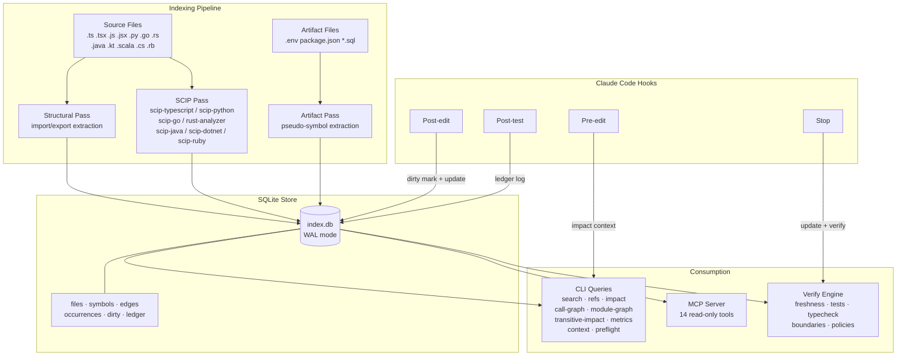

# Ariadne

Semantic code index and gatekeeper for AI coding agents. Builds a compiler-grade symbol graph (defs/refs) via [SCIP](https://sourcegraph.com/docs/code-intelligence/scip) and a file-level dependency graph via import extraction. Exposes queries via CLI and MCP tools.

No LLMs involved — just static analysis.

## What it does

- **Indexes** your codebase (TypeScript, Python, Go, Rust, Java/Kotlin, Scala, C#, Ruby) into a SQLite graph of symbols, references, imports, and definitions
- **Queries** let you search symbols, jump to definitions, find all references, trace impact of changes, explore call graphs, and compute structural metrics
- **Analyzes** transitive impact with risk scoring — BFS across the symbol graph to find all affected files, packages, public API breaks, and relevant tests
- **Detects** structural drift — dependency cycles (Tarjan's SCC), module coupling (Ca/Ce/instability), and public API surface tracking with snapshot-based diffing
- **Enforces** architectural policies via `ariadne.policies.json` — deny new cycles, cap API growth, limit coupling increases
- **Verifies** repo consistency: stale index detection, empty index detection, missing test runs, type errors, architecture boundary violations, and policy compliance
- **Indexes non-code artifacts** — `.env` vars, `package.json` scripts, SQL migrations, OpenAPI schemas — and links them to source references
- **Integrates** with Claude Code via hooks (auto-update on edit, gatekeeper on stop) and MCP tools
- **Works on any existing project** — run `setup` and it indexes everything from disk

## Install

**Requires [Bun](https://bun.sh) >= 1.0**

```bash
# Clone and install
git clone https://github.com/simonrueba/ariadne.git && cd ariadne && bun install

# Set up on your project (one command — init + index + hooks + MCP config)
bun run packages/cli/src/index.ts setup /path/to/your/project
```

SCIP indexers are optional — structural import analysis works without them. Install per language as needed (see [Toolchains by language](#toolchains-by-language) below). Run `ariadne doctor` to check what's available.

## Quick start

### Use on any project (recommended)

```bash
# Set up on your project — does everything in one step:
# init → index → generate hooks + MCP config
bun run packages/cli/src/index.ts setup /path/to/your/project
```

This creates:
- `.ariadne/` — SQLite database, hook scripts, SCIP cache
- `.claude/settings.json` — Claude Code hooks (impact context on edit, auto-update, verify gate)
- `.mcp.json` — MCP server config (14 read-only tools)
- `ariadne.boundaries.json` — auto-generated architecture boundary config (monorepos)

Then restart Claude Code in your project to pick up the hooks and MCP server.

### GitHub Action (CI)

Add structural analysis to your pull requests with a single workflow file:

```yaml
# .github/workflows/ariadne.yml
name: Ariadne Structural Guard

on:
  pull_request:
    branches: [main]

permissions:
  contents: read
  pull-requests: write

jobs:
  structural-analysis:
    runs-on: ubuntu-latest
    steps:
      - uses: actions/checkout@v4
        with:
          fetch-depth: 0

      - uses: simonrueba/ariadne-action@v1
        with:
          comment: 'true'
          fail-on-policy: 'true'
```

This posts a PR comment with impact radius, risk score, public API breaks, new cycles, test coverage, and policy status. See [`action/`](action/) for full configuration options.

### Manual setup (step by step)

```bash
# Initialize .ariadne/ directory
bun run packages/cli/src/index.ts init /path/to/your/project

# Build the full index (structural imports + SCIP symbols)
bun run packages/cli/src/index.ts index /path/to/your/project

# Check prerequisites
bun run packages/cli/src/index.ts doctor /path/to/your/project

# Run gatekeeper checks
bun run packages/cli/src/index.ts verify /path/to/your/project
```

### Query examples

```bash
# Search for a symbol
bun run packages/cli/src/index.ts query search "MyFunction"

# Find definition
bun run packages/cli/src/index.ts query def "<symbol-id>"

# Find all references
bun run packages/cli/src/index.ts query refs "<symbol-id>"

# Impact analysis — what's affected by changes to a file?
bun run packages/cli/src/index.ts query impact src/foo.ts

# Detailed impact — includes symbol defs, docs, and reference snippets
bun run packages/cli/src/index.ts query impact src/foo.ts --details

# Call graph — who calls a function, and what does it call?
bun run packages/cli/src/index.ts query call-graph "<symbol-id>"
bun run packages/cli/src/index.ts query call-graph "<symbol-id>" --depth 2

# File dependency graph (imports only)
bun run packages/cli/src/index.ts query module-graph

# Hybrid module graph (imports + SCIP semantic edges with weights)
bun run packages/cli/src/index.ts query module-graph --mode hybrid

# Scoped to a directory
bun run packages/cli/src/index.ts query module-graph --path packages/core/
```

All commands output JSON. Symbol IDs are SCIP symbol strings returned by `search`.

### Transitive impact analysis

```bash
# Full transitive impact with risk scoring
bun run packages/cli/src/index.ts impact src/core.ts

# Limit BFS depth
bun run packages/cli/src/index.ts impact src/core.ts --max-depth 2

# Include call graph traversal
bun run packages/cli/src/index.ts impact src/core.ts --call-graph

# Multiple files
bun run packages/cli/src/index.ts impact src/core.ts src/utils.ts
```

Returns: changed symbols (with public API flag), affected files (with depth and reason), affected packages, public API breaks (with downstream consumers), test files (direct vs transitive), risk score and category (low/medium/high/critical), boundary violation risk.

### Structural metrics

```bash
# Current metrics (coupling, cycles, API surface)
bun run packages/cli/src/index.ts metrics

# Save baseline snapshot
bun run packages/cli/src/index.ts metrics --snapshot

# Diff current vs baseline
bun run packages/cli/src/index.ts metrics --diff
```

### Policy enforcement

Create `ariadne.policies.json` in your project root:

```json
{
  "policies": {
    "deny_new_cycles": true,
    "max_public_api_growth": 5,
    "max_coupling_increase": 3
  }
}
```

Policies are checked automatically by `ariadne verify`. They compare current metrics against the saved baseline snapshot — run `ariadne metrics --snapshot` to establish the baseline.

## CLI commands

| Command | Description |
|---------|-------------|
| `setup [path] [--quick]` | One-command setup: init + index + generate hooks & MCP config. `--quick` skips SCIP. |
| `init [path]` | Create `.ariadne/` directory and SQLite database |
| `index [path] [--structural-only]` | Full index: structural imports + SCIP analysis. `--structural-only` skips SCIP. |
| `update [--full] [--reingest] [--files path...]` | Incremental update: structural imports + auto SCIP when dirty source files exist. `--files` processes only the specified files (used by hooks for fast single-file updates). `--full` forces SCIP even when clean. `--reingest` forces SCIP re-ingestion even when file contents haven't changed (needed after package renames where symbol IDs change). |
| `query search <query>` | Fuzzy search symbols by name |
| `query def <symbol-id>` | Get definition location, docs, and code snippet |
| `query refs <symbol-id>` | Find all references across the codebase |
| `query impact <path>... [--details]` | Changed files → impacted symbols → dependent files → recommended tests. `--details` adds symbol defs, docs, and up to 3 reference snippets per symbol. |
| `query call-graph <symbol-id> [--depth N]` | Approximate call graph: callers and callees at the given depth (default 1) |
| `query module-graph [--mode] [--path] [--format]` | File dependency graph (imports, semantic, or hybrid) |
| `impact <path>... [--max-depth N] [--call-graph]` | Transitive impact analysis with risk scoring. BFS across symbol graph up to N depths (default 5). `--call-graph` includes caller traversal. |
| `metrics [--snapshot] [--diff]` | Structural metrics: coupling (Ca/Ce/I), dependency cycles, API surface. `--snapshot` saves baseline, `--diff` compares against it. |
| `context <path>... [--depth N] [--mode]` | Compile agent-friendly context for files: symbols, imports, importers, semantic refs. Modes: `compact` (default), `full`, `symbols-only`. |
| `preflight <path>... [--depth N]` | Pre-edit blast radius analysis: symbols defined in files, their call sites across the codebase, boundary violations, and risk assessment. |
| `ci [--base branch] [--markdown] [--root path]` | CI command: runs impact + verify + metrics on changed files vs base branch. Outputs JSON (default) or `--markdown` for PR comments. |
| `verify` | Run gatekeeper checks including policy enforcement (exit 0 = OK, exit 1 = FAIL) |
| `status` | Index stats (file count, symbol count, edge count, dirty count) |
| `dirty mark <path>` | Mark a file as needing re-index |
| `ledger log <event> <json>` | Append event to execution ledger |
| `doctor [path]` | Check prerequisites (Bun, Node, SCIP indexers for all languages) and warn about stale legacy directories |

## MCP server

The MCP server exposes 14 read-only tools for AI agents:

| Tool | Description |
|------|-------------|
| `ariadne.search_symbol` | Fuzzy search symbols by name |
| `ariadne.get_def` | Get symbol definition with docs and code snippet |
| `ariadne.find_refs` | Find all references to a symbol (optionally scoped) |
| `ariadne.impact` | Blast radius analysis for changed files (with optional `details` for symbol defs and key refs) |
| `ariadne.transitive_impact` | Full transitive impact with risk scoring, public API break detection, and affected package mapping |
| `ariadne.metrics` | Structural metrics: module coupling (Ca/Ce/instability), dependency cycles, API surface per package |
| `ariadne.cycles` | Dependency cycle detection using Tarjan's SCC algorithm |
| `ariadne.module_graph` | File dependency graph (imports/semantic/hybrid, json/dot/mermaid) |
| `ariadne.symbol_graph` | Dependency subgraph centered on a specific symbol |
| `ariadne.file_symbols` | List all symbols defined in a file |
| `ariadne.status` | Index stats: files, symbols, dirty count, timestamps |
| `ariadne.call_graph` | Approximate call graph: callers and callees for a symbol |
| `ariadne.plan_context` | Agent-friendly file context: symbols, imports, importers, semantic refs via BFS graph traversal |
| `ariadne.preflight` | Pre-edit blast radius: symbols in target files, call sites, boundary risks, and blast radius summary |

### Configuration

`ariadne setup` generates this automatically. To configure manually, add `.mcp.json` to your project root:

```json
{
  "mcpServers": {
    "ariadne": {
      "command": "bun",
      "args": ["run", "/path/to/ariadne/packages/mcp/src/index.ts"],
      "env": { "ARIADNE_ROOT": "." }
    }
  }
}
```

If you installed via npm (`bun add --global ariadne-mcp`), use:

```json
{
  "mcpServers": {
    "ariadne": {
      "command": "bunx",
      "args": ["ariadne-mcp"],
      "env": { "ARIADNE_ROOT": "." }
    }
  }
}
```

The MCP server starts gracefully even if `.ariadne/` doesn't exist yet — it creates the directory and logs a helpful message.

## Claude Code hooks

`ariadne setup` generates `.claude/settings.json` automatically. The hooks reference portable scripts in `.ariadne/hooks/` that resolve the `ariadne` binary dynamically at runtime.

### What the hooks do

- **Pre-edit impact hook** (`Edit|Write` PreToolUse): runs `ariadne impact` before every source file edit and injects the blast radius (changed symbols, dependent files, recommended tests) as context so Claude sees what will be affected. Silently skips test files, non-source files, and uninitialized projects. ~240ms latency.
- **Post-edit hook** (`Edit|Write` PostToolUse): marks edited source files dirty, runs `ariadne update --files <path>` for fast single-file updates (no full repo walk), logs the edit to the ledger. Non-source files (README, config, etc.) are skipped to avoid false-positive freshness failures.
- **Post-test hook** (`Bash` PostToolUse): detects test runner commands (vitest, jest, pytest, bun test, mocha, ava, cargo test, go test, mvn test, dotnet test, sbt test, bundle exec, playwright), logs `test_run` to the ledger
- **Stop hook**: runs `ariadne update` (auto-triggers SCIP when dirty source files exist), then `ariadne verify`. On failure, outputs `{"decision":"block","reason":"..."}` to prevent Claude from stopping until issues are fixed

The stop hook uses atomic `mkdir`-based locking to prevent concurrent runs, checks `stop_hook_active` from stdin to prevent infinite loops, and has a 120s stale lock timeout.

All hooks guard against missing `.ariadne/` — they silently exit if the project hasn't been initialized.

## Gatekeeper checks

`ariadne verify` runs these checks:

1. **Empty index** — fails if zero files are indexed (prevents vacuous pass on uninitialized projects)
2. **Index freshness** — checks the dirty set (files marked changed by hooks or `update`), filtering to source files only. Fails if any dirty source files exist that haven't been covered by a SCIP index pass. Non-source files are ignored since SCIP can't index them.
3. **Missing test runs** — checks the ledger for a `test_run` event after the most recent `edit`. Fails if no tests were run after editing.
4. **Typecheck** — runs language-appropriate type checkers (`tsc --noEmit`, `go vet`, `cargo check`, `mvn compile`, `sbt compile`, `dotnet build`) against detected projects. Fails on any type errors. On failure, includes recommendations with `ariadne query impact` and `ariadne query search` commands for the affected files and identifiers. Skipped if no supported project is detected.
5. **Architecture boundaries** — reads `ariadne.boundaries.json` and checks all `imports` edges against layer allowlists. Fails if any file imports from a layer not in its `canImport` list. Skipped if no config file exists.
6. **Policy compliance** — reads `ariadne.policies.json` and compares current structural metrics against the saved baseline snapshot. Checks: `deny_new_cycles` (no new dependency cycles), `max_public_api_growth` (cap on new exported symbols per package), `max_coupling_increase` (cap on coupling metric increases per module). Skipped if no config file or no baseline snapshot exists.

## Architecture



## How indexing works

Three-pass pipeline:

1. **Structural pass** (instant, per-file) — regex-based extraction of `import`/`export`/`from`/`use`/`require`/`using` statements across all supported languages. Creates file-level `imports` edges with resolved file paths (e.g. `./utils` → `src/utils.ts`) so edges point to actual file nodes. Runs on every `update`.
2. **SCIP pass** (slower, full project) — runs the appropriate SCIP indexer per detected sub-project, producing a protobuf index. The parser decodes it and extracts symbols, occurrences (with line:col ranges), and definition/reference roles. Creates symbol-level `defines`, `references`, and approximate `calls` edges (via enclosing-definition heuristic). Runs on `index`, `update` (when dirty source files exist), and `update --full` (forced).
3. **Artifact pass** (instant, per-file) — extracts pseudo-symbols from non-code files: `.env` vars (`env_var`), `package.json`/`tsconfig.json` keys (`config_key`), SQL migrations (`table`, `index`), and OpenAPI specs (`api_endpoint`, `api_schema`). Scans dirty source files for references (`process.env.KEY`, `os.environ`, SQL table names) and creates `config_ref` edges. Runs on every `update`.

All passes write to the same SQLite database (`.ariadne/index.db`). The database uses WAL mode, `busy_timeout=5000` for concurrent access from hooks, and transactions for atomic SCIP ingestion. Bulk ingestion uses index-drop/recreate and `PRAGMA synchronous=OFF` for faster writes, and skips unchanged files by content hash comparison.

### Multi-project support

Ariadne auto-detects sub-projects in monorepos by scanning for language-specific config files (`tsconfig.json`, `pyproject.toml`/`setup.py`, `go.mod`, `Cargo.toml`, `pom.xml`/`build.gradle`, `build.sbt`, `.sln`/`.csproj`, `Gemfile`). Each sub-project is indexed independently with correct path prefixing so that SCIP-relative paths map correctly to repo-root-relative file paths.

### Module graph modes

The `module-graph` query supports three modes:

- **imports** (default) — structural import edges only
- **semantic** — SCIP-derived edges with occurrence weights (how many times symbols from file A are referenced in file B)
- **hybrid** — union of both, with source tagging (`import`, `semantic`, or `import+semantic`)

Output formats: `json` (default), `dot` (Graphviz), `mermaid`.

## Project structure

```
packages/
  core/     ariadne-core library (636 tests)
    src/
      store/       SQLite schema, queries (7 focused query classes + facade), types, transactions
      scip/        protobuf parser + SCIP types + call graph derivation
      indexers/    scip-typescript, scip-python, scip-go, scip-rust, scip-java, scip-csharp, scip-ruby, import extractor, project detector, artifact extractor, config ref scanner
      graph/       refs, impact analysis (basic + transitive with risk scoring), call graph, module graph (import/semantic/hybrid), structural metrics (coupling, cycles, API surface), context compiler, preflight analyzer, shared utils
      verify/      gatekeeper engine + checks (freshness, tests, typecheck, boundaries, policies)
      ledger/      execution event log
  cli/      CLI command router + hooks
    src/
      commands/    init, setup, index, update, query, verify, status, dirty, doctor, ledger, impact, metrics, ci, context, preflight
      hooks/       pre-edit-impact.sh, post-edit.sh, post-test.sh, stop-verify.sh
      lib/         context, output helpers
  mcp/      MCP stdio server (14 read-only tools)
```

## Performance

Benchmarked on Ariadne's own codebase (95 files, 3 sub-projects). Apple M3.

| Operation | Time | Notes |
|-----------|------|-------|
| Full index (structural + SCIP + artifacts) | ~17s | One-time; 3 SCIP sub-projects indexed in parallel sequence |
| Incremental update (no changes) | ~120ms | Hash comparison, no I/O |
| Single-file update (hook path) | ~155ms | Targeted file only, no repo walk |
| Pre-edit impact hook | ~170ms | Includes blast radius + symbol details |
| Symbol search | ~80ms | SQLite LIKE query |
| Impact analysis (--details) | ~95ms | Symbols + dependents + test recommendations |
| Verify (all checks) | ~250ms | Freshness + test coverage + typecheck + boundaries |

Hook latency stays under 200ms — fast enough to run on every edit without noticeable delay in Claude Code.

## Development

```bash
bun install
bun test                  # 636 tests across 29 files
bunx tsc --noEmit         # type-check all packages
bun run packages/cli/src/index.ts doctor  # check prerequisites
```

## Toolchains by language

**Required:** [Bun](https://bun.sh) >= 1.0

**Optional:** SCIP indexers add symbol-level analysis (defs/refs/call graph) on top of structural imports. Without them, you still get file-level dependency graphs, import edges, and artifact indexing.

| Language | Extensions | Structural imports | SCIP indexer | Type checker | Install SCIP |
|----------|-----------|-------------------|-------------|-------------|-------------|
| TypeScript / JS | `.ts` `.tsx` `.js` `.jsx` | ES modules, CJS, dynamic | scip-typescript | `tsc --noEmit` | `npx @sourcegraph/scip-typescript` (auto) |
| Python | `.py` | `import`, `from`, relative | scip-python | — | `uvx scip-python` or `pip install scip-python` |
| Go | `.go` | `import "pkg"`, blocks | scip-go | `go vet` | `go install github.com/sourcegraph/scip-go@latest` |
| Rust | `.rs` | `use`, `mod`, `extern crate` | rust-analyzer | `cargo check` | `rustup component add rust-analyzer` |
| Java / Kotlin | `.java` `.kt` | `import`, static imports | scip-java | `mvn compile` / `gradle` | `coursier install scip-java` |
| Scala | `.scala` | `import pkg._`, selective | scip-java | `sbt compile` | `coursier install scip-java` |
| C# | `.cs` | `using`, static/aliased | scip-dotnet | `dotnet build` | `dotnet tool install --global scip-dotnet` |
| Ruby | `.rb` | `require`, `require_relative` | scip-ruby | — | `gem install scip-ruby` |

### Language roadmap

SCIP indexers exist for these languages and could be integrated:

| Language | SCIP Indexer | Status |
|----------|-------------|--------|
| C / C++ | [scip-clang](https://github.com/sourcegraph/scip-clang) | Not yet integrated |
| PHP | [scip-php](https://github.com/davidrjenni/scip-php) | Not yet integrated |
| Swift | sourcekit-lsp SCIP export | Not yet integrated |

Contributions welcome — see [CONTRIBUTING.md](CONTRIBUTING.md).

## License

MIT — see [LICENSE](LICENSE)
